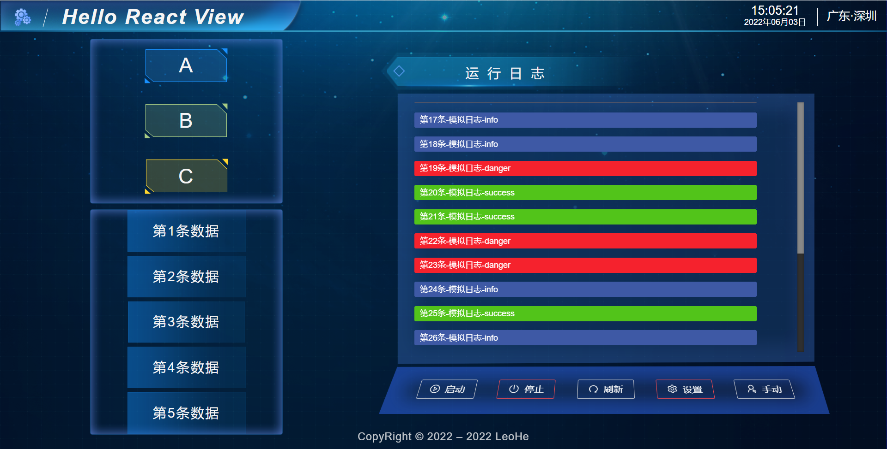

# react-view-cross-platform

> 一个基于 React 的跨平台通用模板(移动/PC/Web)，适用于项目基础框架搭建。

## Technology Stack

* React 17.x
* Redux Toolkit
* TypeScript
* Less/Scss
* ECharts
* Ant Design 4.x
* Vite 3.x
* Cordova
* Electron
* EsLint
* Prettier
* Husky

## Use

```bash
git clone https://github.com/pandaoh/react-view.git

npm i -g js-xcmd
xcmd create-react-view [dir]
```

## Development

* `npm install` or `npm run init`

* `npm run dev` or `npm run dev:app` or `npm run dev:exe`

## Preview

* `npm run server` or `npm run server:app` or `npm run server:exe`

## Build

* `npm run build` or `npm run build:app` or `npm run build:exe`

## Code Check

`npm run lint`

## Icon Handler

* `npm run install:electron-icon`

* `npm run electron-icon`

## Docs

* [React](https://reactjs.bootcss.com/)
* [Redux Toolkit](http://cn.redux.js.org/redux-toolkit/overview/)
* [Vite](https://vitejs.cn/guide/)
* [Ant Design](https://ant.design/components/overview-cn/)
* [Ant Design ProComponents](https://procomponents.ant.design/components/)
* [Scss/Less](https://a.biugle.cn/sass_scss_less/)
* [XHttp](https://www.npmjs.com/package/js-xhttp)
* [Xxx](https://github.com/pandaoh/js-xxx/blob/main/docs/README.md)

## Others

* [Issue](https://github.com/pandaoh/react-view/issues)
* [Pull Request](https://github.com/pandaoh/react-view/pulls)
* [hxbpandaoh@163.com](mailto:hxbpandaoh@163.com)
* [Blog](http://a.biugle.cn)
* Leo He

## Preview

* 本人写的一个小 `Demo`，可以用于参考重构等等。



> Ps：程序员最讨厌的两种行为，一种是别人不写文档，另一种是别人让我写文档。(0.0)
